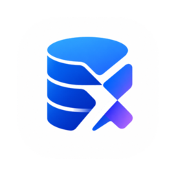
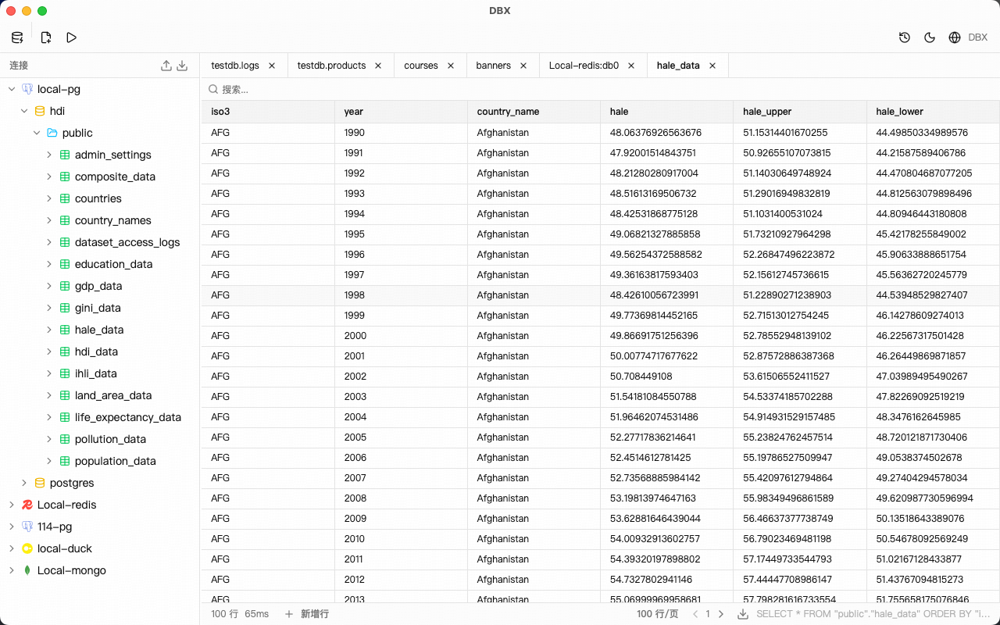
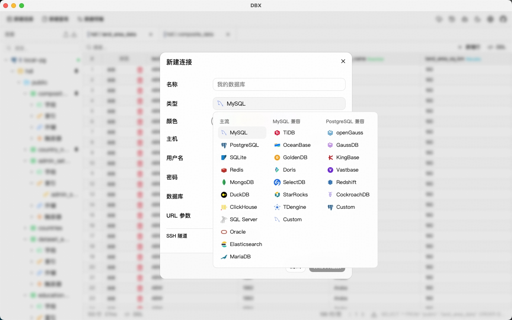
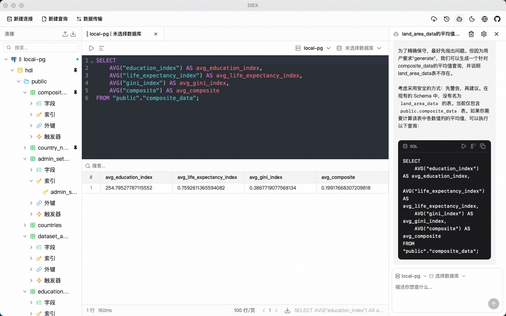

<div align="center">
  
  <h1>DBX</h1>
  <p>开源、轻量、跨平台的数据库管理工具。</p>
  <p>
    <a href="https://github.com/t8y2/dbx/releases"></a>
    <a href="https://github.com/t8y2/dbx/releases"></a>
    <a href="https://github.com/t8y2/dbx/blob/main/LICENSE"></a>
    <a href="https://github.com/t8y2/dbx/graphs/contributors"></a>
    <a href="https://linux.do"></a>
    <a href="#社区"></a>
  </p>
  <p>
    
    
    
    
    
    
    
    
    
    
    
  </p>
  <p>
    <a href="README.md">English</a> | 简体中文
  </p>
</div>

## 功能特性

- **多数据库** — MySQL、PostgreSQL、SQLite、Redis、MongoDB、DuckDB、ClickHouse、SQL Server、Oracle、MariaDB、TiDB、OceanBase、openGauss、GaussDB、KingBase、Vastbase、GoldenDB
- **结构浏览** — 数据库、Schema、表、字段、索引、外键、触发器，支持侧边栏搜索和置顶
- **查询编辑器** — CodeMirror 6 语法高亮、SQL 自动补全（表名和字段）、Cmd+Enter 执行、选中 SQL 执行、SQL 格式化
- **AI SQL 助手** — 自然语言生成 SQL、解释、优化、修复错误（Claude / OpenAI）
- **数据表格** — 虚拟滚动、行内编辑、排序、搜索、分页、列宽调整、行号、斑马纹
- **数据导出** — CSV、JSON、Markdown
- **文件预览** — 拖入 Parquet、CSV、JSON 文件即时预览数据（基于 DuckDB）
- **Redis 浏览器** — 模式匹配搜索，支持全部数据类型（String、Hash、List、Set、ZSet、Stream）
- **MongoDB 浏览器** — 文档增删改查、分页浏览，支持 URL 直连（Atlas、副本集）
- **查询历史** — 持久化存储，支持搜索、恢复、一键复制
- **安全防护** — 执行 DROP / DELETE / TRUNCATE / ALTER 时弹出确认对话框
- **自动重连** — 连接断开后透明重试
- **SSH 隧道** — 支持密钥和密码两种认证方式
- **连接颜色** — 为连接设置颜色标记，快速区分环境
- **自动更新** — 内置版本检查，新版本自动提醒
- **深色模式** — 原生标题栏主题同步
- **多语言** — English & 简体中文
- **极致轻量** — 安装包约 15 MB（不内嵌 Chromium）

## AI 编程助手集成 (MCP)

DBX 提供 [MCP Server](mcp/)，让 AI 编程助手直接使用 DBX 中已配置的数据库连接查询数据。

```bash
npx @dbx-app/mcp-server
```

在 `.mcp.json` 中添加：

```json
{
  "mcpServers": {
    "dbx": { "command": "npx", "args": ["-y", "@dbx-app/mcp-server"] }
  }
}
```

支持 Claude Code、Cursor、Windsurf 等 MCP 兼容的 AI 助手。可列出连接、浏览表、执行 SQL，还能直接在 DBX 界面中打开表。

详见 [MCP Server 说明](mcp/README.md)。

## 截图

<div align="center">
  
  <p>
    
    
  </p>
</div>

## 安装

从 [Releases](https://github.com/t8y2/dbx/releases) 页面下载最新版本。

**Homebrew (macOS)：**

```bash
brew install --cask t8y2/tap/dbx
```

**Scoop (Windows)：**

```bash
scoop bucket add dbx https://github.com/t8y2/scoop-bucket
scoop install dbx
```

### macOS 说明

DBX 未使用 Apple 开发者证书签名，首次打开时 macOS 会阻止运行。解决方法：

```bash
xattr -cr /Applications/DBX.app
```

或者：**系统设置 → 隐私与安全性 → 仍要打开**。

## 快速开始

### 环境要求

- [Node.js](https://nodejs.org/) >= 18
- [pnpm](https://pnpm.io/)
- [Rust](https://www.rust-lang.org/tools/install) >= 1.77

### 开发

```bash
pnpm install
pnpm tauri dev
```

### 构建

```bash
pnpm tauri build
```

安装包输出在 `src-tauri/target/release/bundle/` 目录。

## 技术栈

| 层级 | 技术 |
|------|------|
| 框架 | [Tauri 2](https://tauri.app/) |
| 前端 | [Vue 3](https://vuejs.org/) + TypeScript |
| UI | [shadcn-vue](https://www.shadcn-vue.com/) + Tailwind CSS |
| 编辑器 | [CodeMirror 6](https://codemirror.net/) |
| 后端 | Rust + [sqlx](https://github.com/launchbadge/sqlx) / [tiberius](https://github.com/prisma/tiberius) / [redis-rs](https://github.com/redis-rs/redis-rs) / [mongodb](https://github.com/mongodb/mongo-rust-driver) |

## 社区

[](https://linux.do)

### 交流群

| 微信群 | QQ群 |
|:---:|:---:|
|  |  |

## 贡献者

<a href="https://github.com/t8y2/dbx/graphs/contributors">
  
</a>

## Star History

<a href="https://www.star-history.com/?repos=t8y2%2Fdbx&type=date&legend=top-left">
 <picture>
   <source media="(prefers-color-scheme: dark)" srcset="https://api.star-history.com/chart?repos=t8y2/dbx&type=date&theme=dark&legend=top-left" />
   <source media="(prefers-color-scheme: light)" srcset="https://api.star-history.com/chart?repos=t8y2/dbx&type=date&legend=top-left" />
   
 </picture>
</a>

## 开源协议

[MIT](LICENSE)
