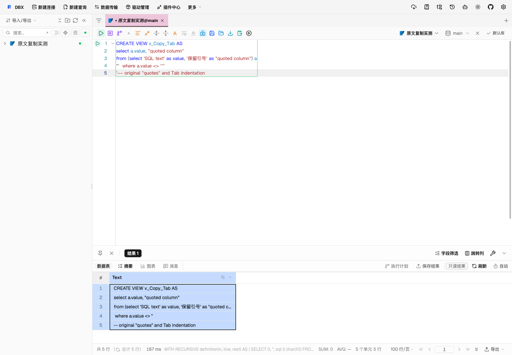
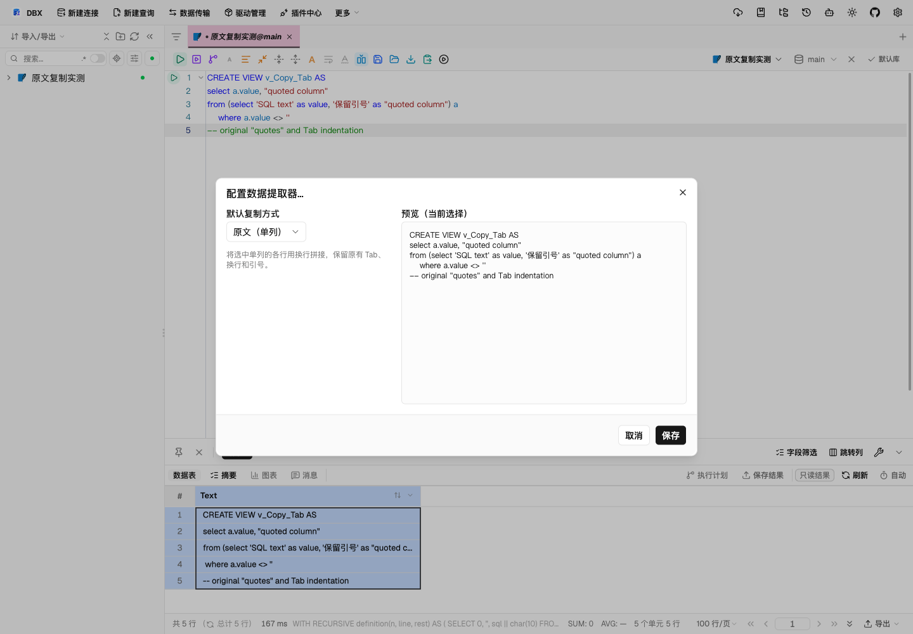

# 查询结果单列多行原文复制验证

## 行为

右键复制菜单中的“原文（单列）”支持单个单元格和单列多行选区。各行以换行拼接，值内的 Tab、单双引号、换行和 SQL 注释保持原样。它可以在“配置数据提取器…”中设为默认格式，供 Ctrl/Cmd+C 使用。

多列选区不支持原文复制。TSV/CSV 的转义和电子表格公式防护继续生效，智能复制也继续对多格选择使用 TSV。

## 真实页面验证（2026-10-09）

环境为 macOS、Chromium、当前分支构建的 dbx-web 和 Vite 页面。使用独立 SQLite 文件，真实创建含 Tab、单双引号和 SQL 注释的视图，从 sqlite_master 读取定义并按行返回为 Text 单列。该结果覆盖反馈中的单列多行复制形态；没有在用户的 SQL Server 原库或打包的 Windows 客户端验证。

视图原文共 5 行、182 个字符、190 个 UTF-8 字节，含一个 Tab。

| 检查 | 结果 |
| --- | --- |
| 旧版 TSV → 系统剪贴板 → SQL 编辑器 | 186 个字符；Tab 行增加字段引用，注释行增加公式防护前缀 |
| 旧版原文提取器 | 多行请求返回 invalid-raw-selection |
| 优化后右键“原文（单列）” → macOS 系统剪贴板 | 与数据库定义逐字节一致，Tab 保留，无新增引号 |
| 从系统剪贴板粘贴到 SQL 编辑器 | 与数据库定义逐字符一致 |
| 配置页原文预览 | 与数据库定义逐字符一致 |
| 保存原文为默认格式，刷新页面、重新查询并 Cmd+C | 仍与数据库定义逐字节一致；复制前用测试标记覆盖剪贴板，确认实际发生了复制 |
| 两列两行全选 | 默认原文菜单项禁用，TSV 等格式可用 |

优化前：

优化后：

原文配置与预览：

## 自动化检查

- dbx-sql-data 全套 522 项通过，包含多行原文、嵌入 CRLF、空末行、Tab、引号、忽略表格引用/表头配置，以及多列拒绝。
- grid_clipboard_guard 12 项通过，包含多行原文保持原样和 TSV/CSV 防护回归。
- 前端相关 6 个测试文件共 346 项通过，覆盖真实菜单组件、复制/预览、网格回粘、默认格式规范化和 12 语言说明。
- vue-tsc、相关 oxlint/oxfmt、cargo fmt --check、git diff --check 通过。
- 实测后端构建：cargo build -p dbx-web --no-default-features --features dbx-core/sqlite-bundled。macOS 系统 SQLite 的无 bundled 构建缺少扩展加载符号，切换仓库已有 bundled 功能后构建成功，无产品代码调整。
