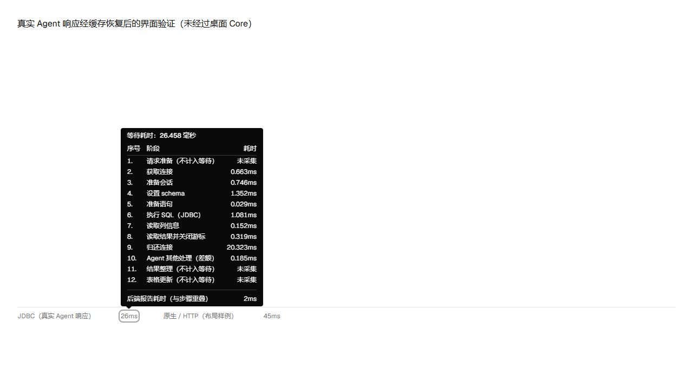
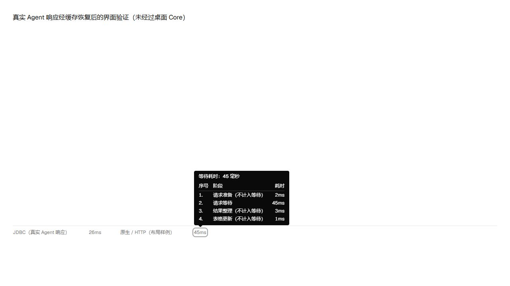

# Query timing details across databases

The query result status bar displays request wait as a number, for example `45ms`. Hover or keyboard focus opens a numbered three-column table. Notes stay in parentheses beside the stage. Escape closes the tooltip.

## Collected stages

- All SQL query tabs, including manual transactions, measure request preparation, backend request wait, result processing and the latest grid update locally. This elapsed request wait includes backend/database processing and transport; it is not database CPU or execution-plan time.
- Java JDBC agents additionally report measured pool acquisition, session preparation, schema selection, statement preparation, execution, metadata, fetch and pool return stages. Only reported internal phases are displayed. Core lock and calculated remainders appear when their inputs exist.
- MongoDB, Redis and Elasticsearch command results use the same common stages. Sequential backend calls within one command accumulate their wait without counting result conversion twice. Local commands without a backend request and continuous Redis MONITOR do not invent a completed-request duration.
- A single SQL batch returning multiple results has no independent client request span per result; unavailable values remain unavailable instead of assigning the whole batch duration to each result.
- Pagination accumulates completed request waits and phase maps, including pages consumed during offset jumps. Grid update timing describes the latest update. Result cache serialization preserves the optional timing fields.
- The backend total, when available with detailed Agent telemetry, overlaps the listed stages. Other wait is a calculated remainder, not measured network time. Missing values are never replaced by zero.
- Normal OceanBase queries no longer run LAST_TRACE_ID or SQL audit lookups for timing. No additional diagnostic SQL is introduced for other databases.





## Verification on 2026-09-24

Environment: Windows, Node with repository dependencies, JDK 21. Tests and regression expectations were prepared before their corresponding implementation. Identified risks included missing/invalid telemetry, double counting, errors, pagination/cache loss, command conversion counted as wait, and regressions to query behavior.

From the repository root:

```sh
node node_modules/vitest/vitest.mjs run apps/desktop/src/components/grid/__tests__/QueryTimingDetails.spec.ts apps/desktop/src/components/grid/__tests__/DataGridSurfaces.spec.ts apps/desktop/src/lib/__tests__/queryRequestTiming.spec.ts apps/desktop/src/lib/__tests__/tabs/tabResultCache.spec.ts apps/desktop/src/stores/__tests__/queryStore.multiStatementError.spec.ts apps/desktop/src/stores/__tests__/queryStore.mongoExecutionSummary.spec.ts apps/desktop/src/stores/__tests__/queryStore.spatialMetadata.spec.ts apps/desktop/src/stores/__tests__/queryStore.hiddenPrimaryKey.spec.ts apps/desktop/src/stores/__tests__/queryStore.provenReadOnlyStickyState.spec.ts apps/desktop/src/composables/__tests__/useResultViewUpdateTiming.spec.ts
node node_modules/vue-tsc/bin/vue-tsc.js --noEmit --project apps/desktop/tsconfig.json
agents/gradlew.bat -p agents :common:test :oceanbase-oracle:test :oceanbase-oracle:shadowJar :db2:test :dameng:test --console=plain
```

234 frontend tests passed. After the final phase-filter adjustment, the three component checks passed again. 405 Java checks passed: common 218, OceanBase 43, DB2 14, Dameng 130. The common pool/cursor test uses embedded H2 through actual multi-session JSON-RPC and confirms nonnegative acquisition, execution, fetch and release measurements while preserving cursor behavior. Driver tests are not evidence of connectivity to external DB2 or Dameng services.

Browser verification mounted the production component, styles, locale and cache codec. The captured JDBC response displayed `26ms` and 12 applicable rows; the native/HTTP layout example displayed `45ms` and four common rows. Keyboard focus opened both tables, values were right-aligned, and Escape closed the popup. The native/HTTP example is synthetic and does not prove live MongoDB, Redis or Elasticsearch execution.

Earlier OceanBase validation, before this cross-database extension, exercised seven read-only JSON-RPC requests against OceanBase Oracle 4.2.5.7 with Connector/J 2.4.18: two 27-table UNION counts, three cursor pages, a capped result and an empty query. It verified rows, phase bounds, cursor lifecycle and absence of trace/audit/server-plan telemetry. This extension does not repeat that external database run.

The prior Rust core check passed for the timing protocol; this extension does not change Rust. Full native desktop Core/store/grid execution and real external services for every supported database remain unverified. No package has been rebuilt for this extension and the PR remains paused.
